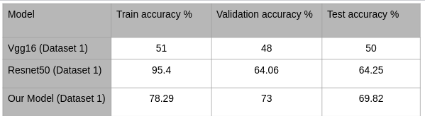
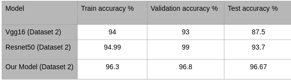

# COVID-19 Detection Using Chest X-Ray

> This file, "README.md" is created in markdown format. To view, this file, either install a [google chrome extension](https://chrome.google.com/webstore/detail/markdown-viewer/ckkdlimhmcjmikdlpkmbgfkaikojcbjk?hl=en) or check it on github link in references.

This document consists of guide to run the code files and details about working environment that have been submitted as our work to the CV project work.

Following sections are divided as follows : 

* Folder Structure : gives insight on how files are arranged in this submission inside `Report`, `Datasets`, `Source_Code` and `Images` sub folders.

* Working Environment : gives insight on what is needed for setting up the system.

* Libraries : insight on libraries used in project code.

* HOW TO Run Code Files? : details on how to run code files.

* Results : result of project work

* References consist of single link linking to github repo where all code is made available.

## Folder Structure

### Report
This directory consists of 2 files :
* ```Report/G7_Presentation.pptx``` : File containing presentation that was delivered during final project work presentation.
* ```Report/G7_Report.pdf``` : This consist of pdf version of report created in latex format describing work performed in the project. Last page of report consist of plagarism report.

### Datasets
We have used two datasets for this project work :

* [Kaggle Radiography Dataset](https://www.kaggle.com/tawsifurrahman/covid19-radiography-database?select=COVID-19_Radiography_Dataset) : It is a publically available chest x-ray image dataset in which total 14000 chest x-ray images belongs to four different classes i.e. COVID-19 Lung Opacity, Normal and Viral pneumonia. But for our case we have taken 2000 images belonging to two classes i.e. COVID-19 and Normal for training and 400 images for testing.

* [Own prepared dataset2](https://drive.google.com/drive/folders/1WXzJGDVeBItkC7ebT8vQTJ9slPs5X0NN?usp=sharing) : We have taken COVID-19 diagnosed chest x-ray images from GitHub and Normal chest x-ray images data from Kaggle and by merging these two we prepared another dataset. Here there are 340 chest x-ray images in total which further split as 220 for training and 120 for testing.

> Radiography dataset is of 745MB and hence is not submitted/uploaded here. Kindly use [link](https://www.kaggle.com/tawsifurrahman/covid19-radiography-database?select=COVID-19_Radiography_Dataset) to visit it.

### Source_Code
Our source code is divided into 3 parts performing three objective of our project work. Here are the deatils :

* ```Source_Code/CV_RESNET50_Final.ipynb``` consist of code containing impllementation of Resnet50 model, its training and prediction.

* ```Source_Code/CV_VGG16_Final.ipynb``` consist of code containing impllementation of VGG-16 model, its training and prediction.

* ```Source_Code/CV_CNN_Final.ipynb``` consist of code containing impllementation of our CNN model, its training and prediction.

### Images
This folder consist of images required to create this readme document.

## Working Environment
* Programming language : Python
* Programming platform : Google Colaboratory

```All code is written and is to be tested over  google colab. All code files have code written to import and handle all the depedencies and libraries. Hence, libraries mentioned below are not required to be sent in project package but are mentioned here just for reference.```

## Libraries Needed
Python packages you need to install. The list of libraries that we have used here are :

* [NumPy](https://numpy.org/install/) - NumPy is an open-source numerical Python library.

* [Pandas](https://pandas.pydata.org/docs/reference/index.html) - Python Data Analysis Library.

* [Matplotlib](https://matplotlib.org/stable/tutorials/introductory/usage.html#sphx-glr-tutorials-introductory-usage-py) - Library for creating static, animated, and interactive visualizations.

* [Random](https://docs.python.org/3/library/random.html#module-random) : This module implements pseudo-random number generators for various distributions. For integers, there is uniform selection from a range. For sequences, there is uniform selection of a random element, a function to generate a random permutation of a list in-place, and a function for random sampling without replacement.

* [Tensorflow](https://www.tensorflow.org/tutorials) : Tensorflow is an end to end open source libraries for creating ML/DL models.

* [OS](https://docs.python.org/3/library/os.html) : This module provides a portable way of using operating system dependent functionality.

## HOW TO Run Code Files?
* Upload file any of the ipynb file on Google-colab. 
* Each file consist code corresponding to each model.
* Upload ```dataset2``` dataset files containing covid and normal chest-xray images.
* Add dataset url in 'train and test' section of code files.
* Run the whole colab file from `runtime > run all` or run each cell one at a time to observe logs.

## Results
* In our work, we worked on binary classification of chest x-ray of patients into COVID-19 affected or normal classes. For this we worked on two datasets. Dataset 1 was a Radiography dataset taken directly from Kaggle and dataset 2 was a mixture of multiple datasets. 
* We trained two state-of-the-art CNN based models, i.e. VGG-16 and Resnet-50. We also developed another CNN based model to do its comparative analysis with VGG-16 and Resnet-50 models. 
* In case of Dataset 1, We achieved the highest test accuracies in case of our CNN model. For VGG-16 accuracy was 50% and in case of Resnet-50 it was 64.25% which shows that our model out-performed these two.
* In case of dataset 2, we achieved better accuracies than database 1 for all three models. The reason for this was that dataset 2 consisted of good quality images. We achieved the highest accuracy of 96.67% for our CNN model and 87.5% for VGG-16 and 93.7% for Resnet-50 model. This shows that our CNN model outperforms both of these models too.

### Dataset 1 : Radiography
* Table showing result for Radiography dataset : 

<br />



### Dataset 2 : Mixture of Dataset
* Table showing result for dataset 2 : 

<br />



## Authors

| Name                    | Roll Number |
|-------------------------|-------------|
| Abhishek Kumar          | 202IT001    |
| Nitin Sharma            | 202IT017    |

## References
* [Github link](https://github.com/weasel-codes/covid19-chest-xray) where project is present and can be referred for future work.